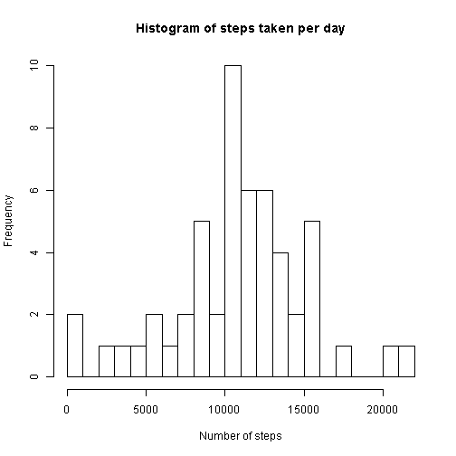
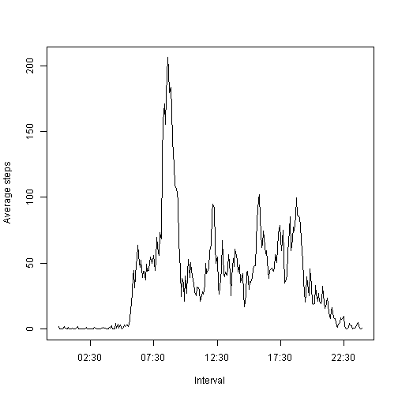
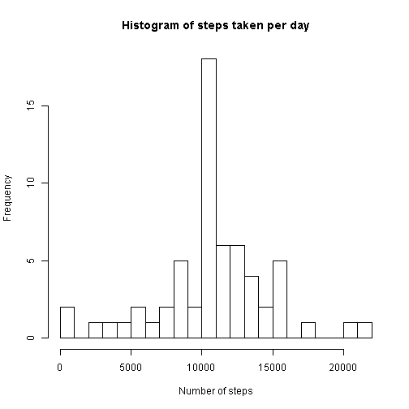
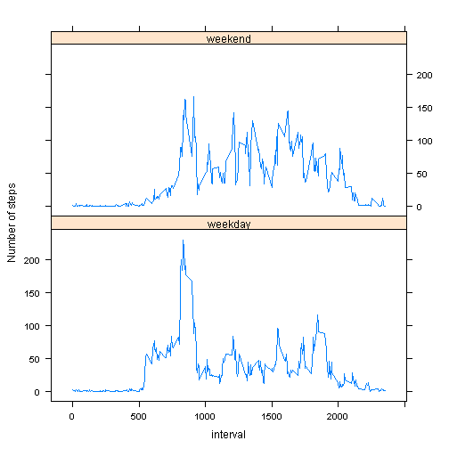

# Reproducible Research: Peer Assessment 1


## Loading and preprocessing the data

The below code calls the library(lattice), reads the activity.csv file, converts the date column to date type and interval to a time format, and stores it as column time


```r
library(lattice)
myData <- read.csv("activity.csv", header = T, colClasses = c("numeric", "character", 
    "numeric"), na.strings = "NA")
myData$date <- as.Date(myData$date, format = "%Y-%m-%d")
time <- strptime(formatC(myData$interval, width = 4, format = "d", flag = "0"), 
    "%H%M")
myData <- cbind(myData, time)
```


Finds the no of steps by day and the avg steps by interval (ignores missing values)


```r
steps_day <- with(myData, aggregate(steps ~ date, myData, sum))
avgsteps_interval <- with(myData, aggregate(steps ~ time, myData, mean))
```


## What is mean total number of steps taken per day?

Produces a histogram of total no of steps for each day


```r
with(steps_day, hist(steps, breaks = 30, xlab = "Number of steps", main = "Histogram of steps taken per day"))
```

 


The mean of the steps (`mean_steps`) and the median (`median_steps`) of the steps are calculated in the below code


```r
mean_steps <- round(mean(steps_day$steps))
median_steps <- round(median(steps_day$steps))
```


The mean of the steps is 10,766 and the median is 10,765

## What is the average daily activity pattern?

The following code produces a time series plot by interval of the average number of steps taken across all days.


```r
with(avgsteps_interval, plot(time, steps, type = "l", xlab = "Interval", ylab = "Average steps"))
```

 


The 5 minute interval which contains the max no of average steps across all days is `interval_max_avgsteps`


```r
interval_max_avgsteps <- format(avgsteps_interval[avgsteps_interval$steps == 
    max(avgsteps_interval$steps), ]$time, "%H:%M")
```


The 5 minute interval containing the max no of avg steps across all days is 08:35

## Imputing missing values

We find out the no of missing values with the help of the `na_count` variable


```r
na_count <- sum(!complete.cases(myData))
```


We assign the mean of the interval for the missing values in the data set in that corresponding interval. This is stored in the data frame `final_data` and steps by day is calculated and stored for this new data frame as `final_steps_day`


```r
indices <- match(myData[is.na(myData$steps), ]$time, avgsteps_interval$time)
final_data <- myData
final_data[is.na(myData$steps), ]$steps <- avgsteps_interval$steps[indices]
final_steps_day <- with(final_data, aggregate(steps ~ date, final_data, sum))
```


New histogram is drawn for the new data frame with missing values replaced with mean.


```r
with(final_steps_day, hist(steps, breaks = 30, xlab = "Number of steps", main = "Histogram of steps taken per day"))
```

 


There seems to be a slight difference in the graph, as we have imputed the ones with missing data with the mean.

Mean of the steps and median of the steps are recalclated for this new data frame (`final_mean_steps` and `final_median_steps` respectively)


```r
final_mean_steps <- mean(final_steps_day$steps)
final_median_steps <- median(final_steps_day$steps)
```


After imputing the missing data with mean, the new mean is 10,766 and 10,766. We observe that the mean remains the same while the median value has changed.

## Are there differences in activity patterns between weekdays and weekends?

This splits the data based on the occurence of weekday or weekend and stores the avg_steps for both the occurences


```r
final_data$date <- as.Date(final_data$date, format = "%Y-%m-%d")
weekends <- weekdays(final_data$date) %in% c("Saturday", "Sunday")
final_data$day_of_week[weekends] <- "weekend"
final_data$day_of_week[!weekends] <- "weekday"
avg_steps <- with(final_data, aggregate(steps ~ interval + day_of_week, final_data, 
    mean))
```


This plots the two different occurences, and we notice the occurence around the mean is maintained more on a weekend than on a weekday. Also, there is a greater peak in the weekday and it's evenly spread across daytime.


```r
with(avg_steps, xyplot(steps ~ interval | day_of_week, layout = c(1, 2), type = "l", 
    ylab = "Number of steps"))
```

 

